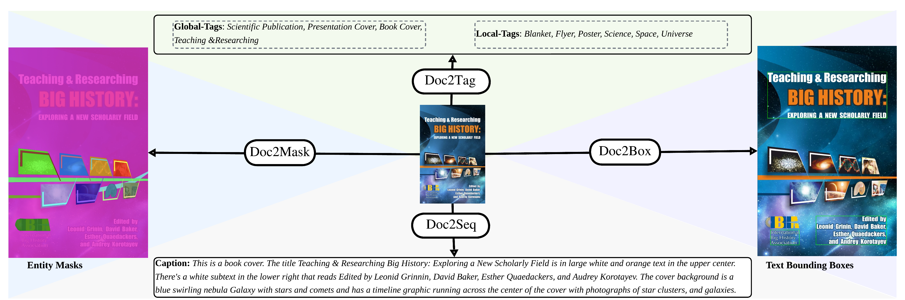

# ADOPD: A Large-Scale Document Page Decomposition Dataset



**ADOPD** is a large-scale dataset for document page decomposition. It introduces a novel data-driven taxonomy discovery approach, combining large-scale pretrained models with human-in-the-loop validation to ensure diversity and balance. ADOPD provides densely annotated document images for four key tasks: **Doc2Mask, Doc2Box, Doc2Tag, and Doc2Seq**. Each image includes entity masks, text bounding boxes, and descriptive tags and captions. Among these tasks, **Doc2Mask** and **Doc2Box** are annotated by humans with model assistance, while **Doc2Tag** and **Doc2Seq** are initially generated by large language models (LLMs) and subsequently refined by human annotators.

### Authors
Jiuxiang Gu, Xiangxi Shi, Jason Kuen, Lu Qi, Ruiyi Zhang, Anqi Liu, Ani Nenkova, Tong Sun

## Download Annotation Files
The dataset annotations can be downloaded [here](https://github.com/adobe-research/adopd2024/releases/tag/v1.0.0).

## Download Images
Images can be downloaded using the image source entries and/or URLs provided in the `json` file or `urls.csv`. Please note that we do not own the copyright of the images. It is solely your responsibility to check the original licenses of the images before using them. Any use of the images is at your own discretion and risk.

## Citation
Please cite our ICLR 2024 paper if you use the ADOPD dataset in your work:
```bibtex
@inproceedings{
gu2024adopd,
title={{ADOPD}: A Large-Scale Document Page Decomposition Dataset},
author={Jiuxiang Gu and Xiangxi Shi and Jason Kuen and Lu Qi and Ruiyi Zhang and Anqi Liu and Ani Nenkova and Tong Sun},
booktitle={The Twelfth International Conference on Learning Representations},
year={2024},
url={https://openreview.net/forum?id=x1ptaXpOYa}
}
```